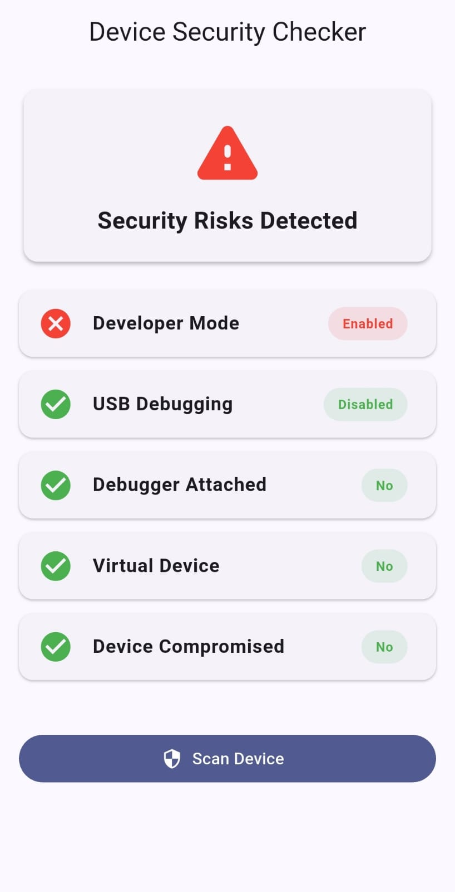
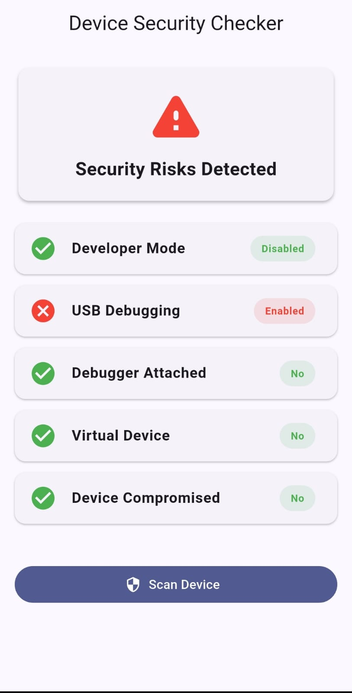
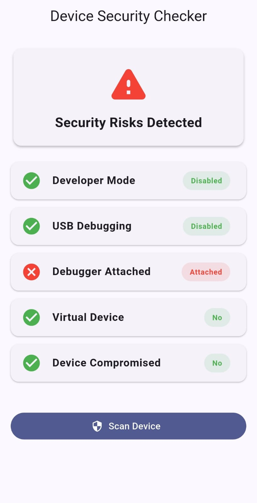
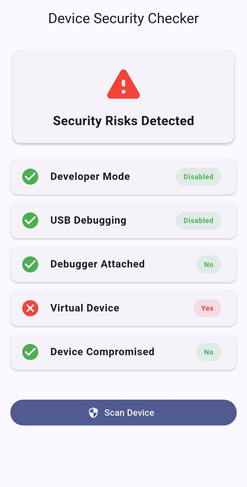
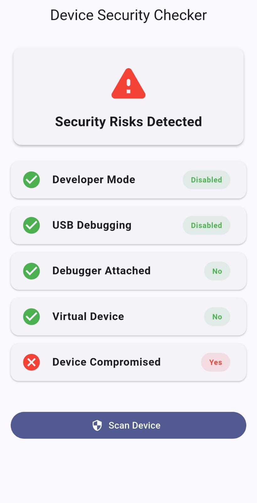
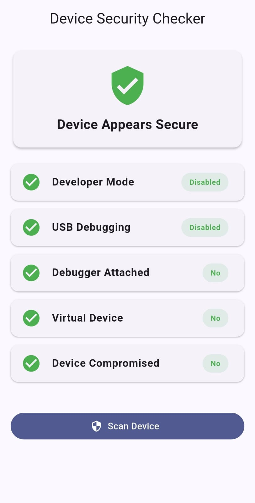

# Device Security Checker

A Flutter plugin for detecting device security risks such as Developer Mode, USB Debugging, virtual
devices, Rooted and other security indicators.

## ✨ Features

- ✅ Detect Developer Mode
- ✅ Detect USB Debugging (Android)
- ✅ Detect Virtual Devices (Emulator / Simulator)
- ✅ Developer Mode Detection
- ✅ Root Detection (Android)
- 🚧 Jailbreak Detection
- 🚧 Debugger Detection
- 🚧 Frida Detection
- 🚧 Play Integrity

## 📱 Platform Support

| Feature            | Android | iOS |
|--------------------|:-------:|:---:|
| Developer Mode     |    ✅    | 🚧  |
| USB Debugging      |    ✅    | N/A |
| Virtual Device     |    ✅    |  ✅  |
| Root Detection     |    ✅    | 🚧  |
| Debugger Detection |    🚧   | 🚧  |

## 📦 Installation

```yaml
dependencies:
  device_security_checker: ^1.1.1
```

Run:

```bash
flutter pub get
```

## 🚀 Usage

## dart

## final report = await DeviceSecurityChecker.scanDevice();

## print(report.developerMode);
## print(report.usbDebugging);
## print(report.rooted);
## print(report.virtualDevice);

## 📊 Example Output

```text
SecurityReport(
  developerMode: false,
  usbDebugging: false,
  virtualDevice: false,
  rooted: false,
  deviceCompromised: false,
  debuggerAttached: false,
)
```

## 📸 Screenshots

### Developer Mode



### USB Debugging



### Debugger Attached



### Virtual Device



### Device Compromised



### Device Secure



## 🛣 Roadmap

- [x] Developer Mode Detection
- [x] USB Debugging Detection
- [x] Virtual Device Detection
- [x] Root Detection
- [ ] Jailbreak Detection
- [ ] Debugger Detection
- [ ] Frida Detection
- [ ] Magisk Detection
- [ ] Play Integrity Support

## 🤝 Contributing

Contributions, bug reports, and feature requests are welcome.

## 📄 License

This project is licensed under the MIT License.